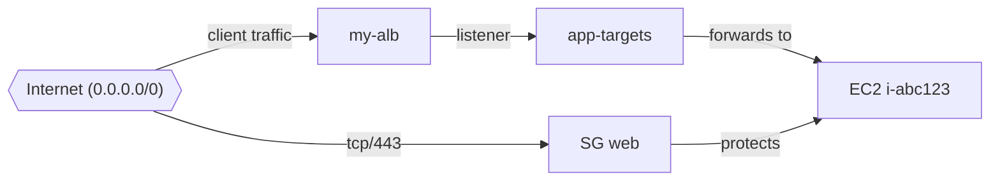

# AWS Account Audit

Read-only Python tool that inventories AWS account resources and produces a security-focused audit report.

## What it collects

**Account and identity**
- Caller identity and Organizations metadata
- IAM users, groups, roles, admin attachments, active access keys, password policy
- Account-level S3 public access block

**Security services**
- GuardDuty, IAM Access Analyzer, CloudTrail, IAM Identity Center

**Resource inventory**
- Resource Groups Tagging API (cross-service ARN inventory with tags)
- EC2 instances, volumes, snapshots, security groups, Elastic IPs
- VPCs, subnets, NAT gateways, load balancers
- Lambda functions and ECS clusters
- RDS instances and DynamoDB tables
- S3 buckets (global), Route53 hosted zones, CloudFormation stacks

**Findings**
- Missing password policy or GuardDuty
- AdministratorAccess on IAM principals
- Public S3 buckets, missing bucket public access blocks
- Public RDS instances, open security group rules
- CloudTrail gaps

## Setup

```bash
cd aws-account-audit
python3 -m venv .venv
source .venv/bin/activate
pip install -r requirements.txt
npm install
```

Requires AWS credentials via profile, environment variables, or instance role.

## Usage

```bash
# Full audit, all enabled regions, JSON + text output
python -m aws_account_audit --profile my-profile --output-dir ./audit-runs

# Single home region only
python -m aws_account_audit --profile my-profile --no-all-regions --region eu-west-1

# Explicit regions
python -m aws_account_audit --profile my-profile --regions eu-west-1 us-east-1

# Identity and security only
python -m aws_account_audit --profile my-profile --sections identity iam security_services

# Print report to stdout
python -m aws_account_audit --profile my-profile --stdout
```

## Output

Reports are written to `--output-dir` (default: `./audit-runs`):

- `audit-<account-id>-<timestamp>.json` — structured data for automation
- `audit-<account-id>-<timestamp>.log` — human-readable summary

## Permissions

The tool is read-only. Effective access depends on the caller's IAM permissions. For broad inventory coverage, use a role with read access such as `ReadOnlyAccess` plus:

- `resourcegroupstagging:GetResources`
- `organizations:DescribeOrganization` / `organizations:ListAccounts` (optional)
- `iam:GenerateCredentialReport` / `iam:GetCredentialReport` (optional)

Some APIs return access denied errors for specific services; those are recorded in the report and the audit continues.

## Related tooling

This complements `build-account-isolation/scripts/audit-iam.sh`, which focuses on IAM-only checks from the shell.

---

## AWS Network Map

Trace ingress paths and network connections for a specific resource and render a diagram.

Supported resource types:

- EC2 instances (`i-...`)
- Security groups (`sg-...`)
- Application / Network load balancers (name or ARN)
- RDS instances (identifier or ARN)
- Lambda functions (ARN)

The mapper walks security groups, subnets, route tables, NACLs, IGW/NAT paths, load balancer listeners/target groups, and peer SG references.

### Usage

```bash
# Mermaid diagram for an EC2 instance
python -m aws_network_map --resource i-0123456789abcdef0 --region eu-west-1

# Security group ingress and attached instances
python -m aws_network_map --resource sg-0123456789abcdef0 --format text

# Load balancer by name
python -m aws_network_map --resource my-public-alb --type alb --region eu-west-1

# JSON graph for automation
python -m aws_network_map --resource my-db --type rds_instance --format json

# Export bundle (default): .md, .png, .html, and .json
python -m aws_network_map --resource i-abc123 --region eu-west-1 --output-dir ./network-maps

# Named export base path (writes my-resource.{md,png,html,json})
python -m aws_network_map --resource sg-abc123 --output ./network-maps/my-resource

# Single-format output to stdout or one file
python -m aws_network_map --resource i-abc123 --format html --output map.html
python -m aws_network_map --resource i-abc123 --format json --output map.json

# Loop from audit output (maps every open SG target found in report)
python -m aws_network_map.from_audit \
  --audit-json ./audit-runs/audit-123456789012-2026-06-24T151351+0000.json \
  --output-dir ./network-maps/from-audit
```

Default `export` writes four companion files from the same base name:

| File | Purpose |
|------|---------|
| `.md` | Report with embedded PNG, Mermaid source, paths, links to HTML/JSON |
| `.png` | Diagram image |
| `.html` | Interactive standalone page with Mermaid renderer |
| `.json` | Node/edge graph for automation |

PNG rendering uses `@mermaid-js/mermaid-cli`. From `aws-account-audit/` run:

```bash
npm install
```

That installs a local `mmdc` used automatically. You can also install it globally with `npm install -g @mermaid-js/mermaid-cli`.

Paste Mermaid output into GitHub, Obsidian, or [mermaid.live](https://mermaid.live) to view the diagram.

Example Mermaid output:



### Permissions

Read-only EC2, ELBv2, RDS, and Lambda APIs in the target region(s).

