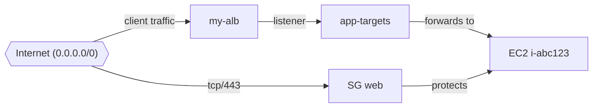

# AWS Account Audit

Read-only Python tool that inventories AWS account resources and produces a security-focused audit report.

## What it collects

**Account and identity**
- Caller identity and Organizations metadata
- IAM users, groups, roles, admin attachments, active access keys, password policy
- Account-level S3 public access block

**Security services**
- GuardDuty, IAM Access Analyzer, CloudTrail, IAM Identity Center

**Resource inventory**
- Resource Groups Tagging API (cross-service ARN inventory with tags)
- EC2 instances, volumes, snapshots, security groups, Elastic IPs
- VPCs, subnets, NAT gateways, load balancers
- Lambda functions and ECS clusters
- RDS instances and DynamoDB tables
- KMS keys (metadata, rotation status, last-used via CloudTrail)
- S3 buckets (global), Route53 hosted zones, CloudFormation stacks

Per-resource detail captured for the inventory listing (location, size, type, version as applicable):

| Resource | Location | Size | Type | Version |
|----------|----------|------|------|---------|
| EC2 instance | Availability zone | instance type | instance type / platform | AMI / platform details |
| EBS volume | Availability zone | size (GiB) | volume type (gp3, io2, ...) | — |
| RDS instance | Availability zone | allocated storage (GiB) | instance class | engine + engine version |
| RDS cluster | Region | member count | engine mode (Aurora/provisioned) | engine + engine version |
| Load balancer (ELB) | Availability zones | — | application / network / classic | — |
| Lambda function | Region | memory (MB) + code size | architecture (x86_64 / arm64) | runtime + published version |
| EventBridge bus | Region | — | — | — |
| EventBridge rule | Region | target count | schedule or event pattern | state |
| S3 bucket | Region | — | — | — |
| DynamoDB table | Region | — | — | — |
| KMS key | Region | — | symmetric / asymmetric spec | key usage |
| WAF Web ACL | Region or global (CloudFront) | rule count | REGIONAL / CLOUDFRONT scope | default action (Allow/Block) |

**Findings**
- Missing password policy or GuardDuty
- AdministratorAccess on IAM principals
- Public S3 buckets, missing bucket public access blocks
- Public RDS instances, open security group rules
- CloudTrail gaps
- Customer managed KMS keys without rotation, or pending deletion

## Setup

```bash
cd aws-account-audit
python3 -m venv .venv
source .venv/bin/activate
pip install -r requirements.txt
npm install
```

Requires AWS credentials via profile, environment variables, or instance role.

## Usage

```bash
# Full audit, all enabled regions, JSON + text output
python -m aws_account_audit --profile my-profile --output-dir ./audit-runs

# Single home region only
python -m aws_account_audit --profile my-profile --no-all-regions --region eu-west-1

# Explicit regions
python -m aws_account_audit --profile my-profile --regions eu-west-1 us-east-1

# Identity and security only
python -m aws_account_audit --profile my-profile --sections identity iam security_services

# Print report to stdout
python -m aws_account_audit --profile my-profile --stdout

# Skip the separate resource inventory files
python -m aws_account_audit --profile my-profile --no-inventory
```

## Output

Reports are written to `--output-dir` (default: `./audit-runs`):

- `audit-<account-id>-<timestamp>.json` — structured audit data for automation (unchanged)
- `audit-<account-id>-<timestamp>.log` — human-readable audit summary (unchanged)
- `audit-<account-id>-<timestamp>-inventory.json` — detailed resource inventory (additive)
- `audit-<account-id>-<timestamp>-inventory.log` — human-readable resource inventory tables (additive)
- `audit-<account-id>-<timestamp>-inventory.html` — interactive resource inventory tables with a live filter (additive)

The standard audit JSON and log outputs are unchanged. When inventory collection is enabled
(default), additional files list EC2 instances, EBS volumes, RDS instances and clusters,
load balancers (ELB), Lambda functions, EventBridge buses and rules, S3 buckets, DynamoDB
tables, and WAF Web ACLs with location, size, type, and version where they apply. The `-inventory.html` page renders each resource type as a sortable,
zebra-striped table with summary counts and a search box to filter rows across all tables.
Disable inventory with `--no-inventory`.

## Permissions

The tool is read-only. Effective access depends on the caller's IAM permissions. For broad inventory coverage, use a role with read access such as `ReadOnlyAccess` plus:

- `resourcegroupstagging:GetResources`
- `kms:ListKeys`, `kms:DescribeKey`, `kms:ListAliases`, `kms:GetKeyRotationStatus`
- `cloudtrail:LookupEvents` (optional; enriches KMS last-used timestamps from the last 90 days)
- `organizations:DescribeOrganization` / `organizations:ListAccounts` (optional)
- `iam:GenerateCredentialReport` / `iam:GetCredentialReport` (optional)

Some APIs return access denied errors for specific services; those are recorded in the report and the audit continues.

## IAM Permission Audit Script

For fast IAM/account-permission auditing from the shell, this repo also includes:

- `scripts/audit-iam.sh`

Usage examples:

```bash
# Run with default region (eu-west-1) and active AWS credentials
./scripts/audit-iam.sh

# Run with explicit profile and region
./scripts/audit-iam.sh --profile my-profile --region us-east-2

# Save output log file
./scripts/audit-iam.sh --profile my-profile --output-dir ./audit-runs/iam-shell
```

This script is read-only and focuses on IAM, Identity Center, account security controls, and org visibility.

## IAM Relationship Graph

To visualize how IAM users, groups, roles, and policies relate, run:

```bash
# Writes JSON + HTML + PNG
python -m aws_account_audit.iam_graph \
  --profile my-profile \
  --region eu-west-1 \
  --output-base ./network-maps/iam-graph
```

Outputs:

- `<output-base>.json` - graph data for automation
- `<output-base>.html` - interactive Mermaid graph
- `<output-base>.png` - rendered image
- `<output-base>-sections/section-*.png` - the PNG sliced into overlapping, zoom-friendly tiles (large graphs only)

For large accounts the single PNG is tall; two ways to read the detail:

```bash
# One large, zoomable PNG (sharper, but a big file)
python -m aws_account_audit.iam_graph --output-base ./network-maps/iam-graph --png-scale 4

# Overlapping section tiles are written by default for large graphs.
# Disable them with:
python -m aws_account_audit.iam_graph --output-base ./network-maps/iam-graph --no-sections
```

The IAM graph includes:

- User/group/role principal nodes
- Managed and inline policy nodes
- User->group membership links
- Principal->policy attachment links
- Role trust relationships (role->trusted principal)

The graph defaults to left-to-right (`LR`) layout. Because IAM nodes are grouped into
per-kind subgraphs (Users / Groups / Roles / Policies / Trust principals), a top-to-bottom
(`TB`) layout spreads the policy row across tens of thousands of pixels and produces a PNG
that looks horizontally cut off. `LR` keeps the PNG readable. Pass `--direction TB` to
override. For very large accounts, open the `.html` file for full pan/zoom instead of the PNG.

## Account Check (All-In-One)

For a single command that audits an account, maps resources, builds an account graph, and runs a full IAM audit with relationship graphs:

For a single-command full account check across all enabled regions:

```bash
python -m aws_account_audit.account_check \
  --profile my-profile \
  --all-regions \
  --output-dir ./account-check-runs
```

To limit the run to one region, pass `--region` (without `--all-regions`):

```bash
python -m aws_account_audit.account_check \
  --profile my-profile \
  --region eu-west-1 \
  --output-dir ./account-check-runs
```

To scan every active account in an AWS Organization (opt-in; off by default), run from the
management account (or another principal with `organizations:ListAccounts` and permission to
assume a cross-account role in each member account):

```bash
python -m aws_account_audit.account_check \
  --profile org-mgmt \
  --scan-organization \
  --org-role-name OrganizationAccountAccessRole \
  --region eu-west-1 \
  --output-dir ./account-check-runs
```

Per-account outputs still land under `./account-check-runs/account-<account-id>/`. The
management account uses your caller credentials directly; member accounts are scanned via
`sts:AssumeRole`. Org-level indexes are written to
`./account-check-runs/organization-<org-id>/organization-check-summary.json` and
`./account-check-runs/organization-<org-id>/organization-view.html` (links into each
account's `account-view.html` and `findings.html` with finding counts). Org-wide findings
are on `organization-findings.html` in the same directory.

Optional filters:

```bash
# Only specific accounts
python -m aws_account_audit.account_check --scan-organization --org-accounts 111111111111 222222222222 ...

# Skip accounts
python -m aws_account_audit.account_check --scan-organization --org-exclude-accounts 333333333333 ...
```

This writes grouped outputs under `./account-check-runs/account-<account-id>/`:

- `account-view.html` — full account view with artifact lists and severity summary (start here)
- `findings.html` — dedicated security findings page (linked from account view)
- `audit-runs/` — account inventory audit (`.json` + `.log`)
- `iam-runs/` — IAM audit JSON, shell audit log, IAM relationship graph (`.json`, `.html`, `.png`), and `iam-graph-<account-id>-sections/` zoom-friendly PNG tiles
- `network-maps/from-audit/` — per-resource network maps from audit findings (`.json`, `.html`, `.png`, `.md`)
- `network-maps/all-security-groups/` — per-SG network maps for the whole account
- `network-maps/account-graph-<account-id>.*` — merged account-wide network graph (`.json`, `.html`, `.png`), including resource-inventory nodes
- `audit-runs/*-inventory.html` — interactive resource inventory tables (linked from `account-view.html`)
- `network-maps/combined-json/resource-inventory-overlay.json` — inventory nodes/edges merged into the account graph
- `account-check-summary.json` — machine-readable index of all generated artifacts

The account graph also overlays the resource inventory (EC2, EBS, RDS, ELB, Lambda, S3,
DynamoDB) as nodes grouped under per-region anchors, with labels carrying location, size,
type, and version. These appear in the `Compute`, `Storage`, `Load balancers`, and `Regions`
subgraphs of the account-graph PNG/HTML. Disable the overlay with `--no-inventory-graph`.

`account-view.html` summarizes the account, links every artifact (interactive HTML graphs
marked "full view"), and links to `findings.html` for the detailed security findings list.
Open it in a browser to navigate the whole run without depending on the static PNGs.

Graphs use color-coded node types, grouped subgraphs, and a scrollable HTML viewer with legend. The interactive HTML graphs are click-to-explore: click any node to highlight its full connected chain (and dim everything else), then click empty space or press `Esc` to reset. PNG exports scale viewport size and render resolution with graph size so large account maps stay sharp when zoomed. The IAM relationship graph defaults to `LR` layout so its PNG stays readable; network graphs default to `TB`.

Optional flags:

```bash
# Skip the shell IAM audit script (keeps IAM JSON + graph)
--skip-iam-shell-audit

# Limit SG mapping volume on large accounts
--max-security-groups 50

# Mermaid direction for network graphs (default: TB)
--direction LR

# Mermaid direction for the IAM relationship graph (default: LR)
--iam-direction TB

# Render the IAM PNG as one large, zoomable image instead of default resolution
--iam-png-scale 4

# Skip slicing the IAM PNG into section tiles
--no-iam-sections

# Skip resource inventory collection (no *-inventory files or graph overlay)
--no-inventory

# Skip overlaying the resource inventory onto the account graph (inventory files still written)
--no-inventory-graph
```

---

## AWS Network Map

Trace ingress paths and network connections for a specific resource and render a diagram.

Supported resource types:

- EC2 instances (`i-...`)
- Security groups (`sg-...`)
- Application / Network load balancers (name or ARN)
- RDS instances (identifier or ARN)
- Lambda functions (ARN)

The mapper walks security groups, subnets, route tables, NACLs, IGW/NAT paths, load balancer listeners/target groups, and peer SG references.

### Usage

```bash
# Mermaid diagram for an EC2 instance
python -m aws_network_map --resource i-0123456789abcdef0 --region eu-west-1

# Security group ingress and attached instances
python -m aws_network_map --resource sg-0123456789abcdef0 --format text

# Load balancer by name
python -m aws_network_map --resource my-public-alb --type alb --region eu-west-1

# JSON graph for automation
python -m aws_network_map --resource my-db --type rds_instance --format json

# Export bundle (default): .md, .png, .html, and .json
python -m aws_network_map --resource i-abc123 --region eu-west-1 --output-dir ./network-maps

# Named export base path (writes my-resource.{md,png,html,json})
python -m aws_network_map --resource sg-abc123 --output ./network-maps/my-resource

# Single-format output to stdout or one file
python -m aws_network_map --resource i-abc123 --format html --output map.html
python -m aws_network_map --resource i-abc123 --format json --output map.json

# Loop from audit output (maps every open SG target found in report)
python -m aws_network_map.from_audit \
  --audit-json ./audit-runs/audit-123456789012-2026-06-24T151351+0000.json \
  --output-dir ./network-maps/from-audit

# Account-wide merged graph (fresh audit -> map loop -> single JSON+HTML graph)
python -m aws_network_map.account_graph \
  --run-audit \
  --output-base ./network-maps/account-graph

# Account-wide merged graph from an existing audit report
python -m aws_network_map.account_graph \
  --audit-json ./audit-runs/audit-123456789012-2026-06-24T151351+0000.json \
  --map-dir ./network-maps/from-audit \
  --output-base ./network-maps/account-graph-from-report

# Account-wide merged graph from existing map JSON files only (no re-mapping)
python -m aws_network_map.account_graph \
  --audit-json ./audit-runs/audit-123456789012-2026-06-24T151351+0000.json \
  --map-dir ./network-maps/from-account-current \
  --output-base ./network-maps/account-graph-current \
  --skip-mapping

# Account-wide merged graph with explicit profile and regions
python -m aws_network_map.account_graph \
  --run-audit \
  --profile my-profile \
  --regions us-east-1 us-east-2 \
  --output-base ./network-maps/account-graph-us
```

Default `export` writes four companion files from the same base name:

| File | Purpose |
|------|---------|
| `.md` | Report with embedded PNG, Mermaid source, paths, links to HTML/JSON |
| `.png` | Diagram image |
| `.html` | Interactive standalone page with Mermaid renderer |
| `.json` | Node/edge graph for automation |

PNG rendering uses `@mermaid-js/mermaid-cli`. From `aws-account-audit/` run:

```bash
npm install
```

That installs a local `mmdc` used automatically. You can also install it globally with `npm install -g @mermaid-js/mermaid-cli`.

Paste Mermaid output into GitHub, Obsidian, or [mermaid.live](https://mermaid.live) to view the diagram.

Example Mermaid output:



### Permissions

Read-only EC2, ELBv2, RDS, and Lambda APIs in the target region(s).

## Command Combinations

### `aws_account_audit`

- Full account scan: `python -m aws_account_audit --output-dir ./audit-runs`
- One region only: `python -m aws_account_audit --no-all-regions --region eu-west-1`
- Explicit regions: `python -m aws_account_audit --regions eu-west-1 us-east-2`
- Section-limited scan: `python -m aws_account_audit --sections identity iam security_services`
- IAM relationship graph export: `python -m aws_account_audit.iam_graph --output-base ./network-maps/iam-graph`
- One-command full account check (audit + resource maps + account graph + IAM graph): `python -m aws_account_audit.account_check --profile my-profile --output-dir ./account-check-runs`

### `aws_network_map`

- One resource map export: `python -m aws_network_map --resource sg-abc123 --region us-east-2 --output-dir ./network-maps`
- One resource JSON only: `python -m aws_network_map --resource i-abc123 --format json --output map.json`
- Force type: `python -m aws_network_map --resource my-public-alb --type alb --region us-east-2`

### `aws_network_map.from_audit`

- Default loop from audit findings: `python -m aws_network_map.from_audit --audit-json ./audit-runs/<audit-file>.json --output-dir ./network-maps/from-audit`
- Profile + region filter: `python -m aws_network_map.from_audit --audit-json ./audit-runs/<audit-file>.json --profile my-profile --regions us-east-2`
- Dry run: `python -m aws_network_map.from_audit --audit-json ./audit-runs/<audit-file>.json --dry-run`

### `aws_network_map.account_graph`

- Full pipeline (audit -> map loop -> merged outputs): `python -m aws_network_map.account_graph --run-audit --output-base ./network-maps/account-graph`
- Use existing audit report: `python -m aws_network_map.account_graph --audit-json ./audit-runs/<audit-file>.json --map-dir ./network-maps/from-audit --output-base ./network-maps/account-graph-from-report`
- Merge existing map JSON only: `python -m aws_network_map.account_graph --audit-json ./audit-runs/<audit-file>.json --map-dir ./network-maps/from-account-current --output-base ./network-maps/account-graph-current --skip-mapping`
- Dry run: `python -m aws_network_map.account_graph --run-audit --dry-run`

`aws_network_map.account_graph` writes:

- `<output-base>.json` (merged graph data)
- `<output-base>.html` (interactive Mermaid view)
- `<output-base>.png` (rendered diagram image)

### Notes

- If `from_audit` reports "No security group targets found in report", there may be no current open-SG findings to map.
- In that case, you can still generate account graphs by mapping known resources directly with `aws_network_map` and then running `account_graph --audit-json <path> --map-dir <dir> --output-base <base> --skip-mapping`.

## Linting, Build, and Tests

This repo includes Python quality tooling and an npm smoke test for Mermaid CLI via CI (`.github/workflows/python-quality.yml`).
Recommended workflow: create a feature branch and open a PR instead of committing directly to `main`.

Run locally:

```bash
python -m pip install -e ".[dev]"
ruff check .
ruff format --check .
python -m build
python -m compileall aws_account_audit aws_network_map tests
pytest -q
npm ci
npm test
```

## Version Tagging

Main branch commits are automatically tagged using semantic version tags via `.github/workflows/main-version-tag.yml`.

- First tag when no version tags exist: `v1.0.0`
- Subsequent tags on each new `main` commit: patch increments (`v1.0.1`, `v1.0.2`, ...)
- No release artifacts are created; tags are for source tracking only.

